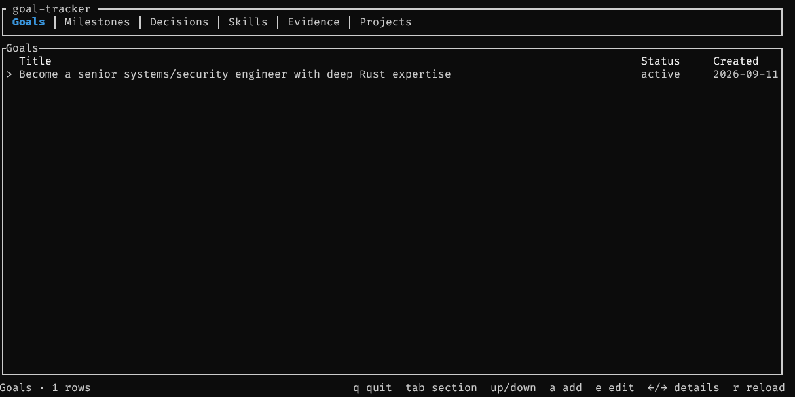

# goal-tracker

A personal, multi-year engineering roadmap. The database records **what happened**
and **what is currently believed**; it does not encode a permanent definition of a
career.

## Workspace

- `core` — domain model and SQLite persistence (`rusqlite`).
- `tui` — terminal UI (`ratatui`).

## Model

Entities: `Goal` (versioned via `GoalVersion`), `Skill`, `Milestone`, `Evidence`,
`Project`, and `Decision`.

Editing a goal's title or description closes its current `GoalVersion` and opens
a new one; status changes do not. The version is written in the same transaction
as the goal itself. Deleting a skill cascades to its milestone links and skill
relationships.

Goals and skills are the current hypothesis and may be restructured freely.
Milestones, evidence and decisions are historical records and are not rewritten
when the hypothesis changes.

Relationships live in separate tables:

| Relationship                      | Table                    |
| --------------------------------- | ------------------------ |
| Goal motivates Milestone          | `milestone_goals`        |
| Milestone demonstrated by Evidence| `milestone_evidence`     |
| Milestone demonstrates Skill      | `milestone_skills`       |
| Milestone implemented in Project  | `milestone_projects`     |
| Milestone depends on Milestone    | `milestone_dependencies` |
| Skill related to Skill            | `skill_relationships`    |

Timestamps are RFC 3339 text. Identifiers are text generated with a short prefix.

## Usage

The `goal-tracker` binary does both: with no command it opens the terminal UI,
which browses, adds and edits records; with a command it writes to the database
without opening the UI. The database path is global via `-d`/`--db` (default
`goal-tracker.db`). Opening a database applies versioned migrations
(`PRAGMA user_version`) and verifies that the schema matches the model.



```sh
# Populate from a TOML seed file. The file is personal data and gitignored.
# A seed file describes one goal. Seeding is idempotent per goal id and applies
# the whole file in a single transaction; --force resets and re-seeds atomically.
goal-tracker seed --file roadmap.seed.toml
goal-tracker seed --file roadmap.seed.toml --force

# Export every record to a readable text file (default roadmap.txt).
goal-tracker export
goal-tracker export -o dump.txt

# Add records; the new id is printed.
goal-tracker add goal --title "Become a systems/security engineer"
goal-tracker add skill --name "Rust" --status learning
goal-tracker add milestone --title "Bounded async pipeline"
goal-tracker add evidence --title "OTel SQLite" --type repository --url https://example.invalid
goal-tracker add project --name "DeployKit" --repository https://example.invalid/deploykit

# Link records using their ids.
goal-tracker link goal   <milestone-id> <goal-id>
goal-tracker link skill  <milestone-id> <skill-id>
goal-tracker link dependency <milestone-id> <prerequisite-milestone-id>
goal-tracker link skill-relationship <from-skill-id> <to-skill-id> encompasses

# Inspect everything in the terminal UI, or use a specific database.
goal-tracker
goal-tracker -d roadmap.db
```

In the TUI:

| Key                 | Action                                  |
| ------------------- | --------------------------------------- |
| `q` / `esc`         | Quit (esc collapses details first, or cancels an open form) |
| `tab` / `shift-tab` | Switch section                          |
| `up`/`down` (`k`/`j`) | Move selection                       |
| `right` / `left`    | Expand / collapse the selected record's full text |
| `a`                 | Add a record in the current section      |
| `e` / `enter`       | Edit the selected record                 |
| `r`                 | Reload from the database                 |
| `enter` (in form)   | Save                                    |
| `tab` / `up`/`down` (in form) | Move between fields          |
| `backspace`         | Delete a character in the focused field |

Enum fields show their accepted values in the footer, and long values are
truncated to their column. Press `right` on a record to read the untruncated
text in a pane below the list. The Skills table shows each skill's 0-10 level as
a bar (set it in the form, `add skill --level`, or the seed).

Statuses and types are parsed from the model's canonical strings (for example
`active`, `planned`, `in_progress`, `completed`, `repository`). Run
`goal-tracker add <entity> --help` for the accepted flags.

The same operations are available as a library through `core`:

```rust
use goal_tracker_core::{model, store, Database};

let database = Database::open("roadmap.db")?;
let goal = model::Goal {
    id: model::new_id("goal"),
    title: "Become a systems/security engineer".to_owned(),
    description: None,
    status: model::GoalStatus::Active,
    created_at: model::now(),
    archived_at: None,
};
store::insert(database.connection(), &goal)?;
```

`store` provides the same generic operations for every record type: `insert`,
`get`, `list`, `list_where`, `update`, `delete`, and `delete_where`. Multi-step
writes go through `Database::with_transaction`.

## Development

```sh
cargo fmt
cargo clippy --all-targets
cargo test
cargo build
```
