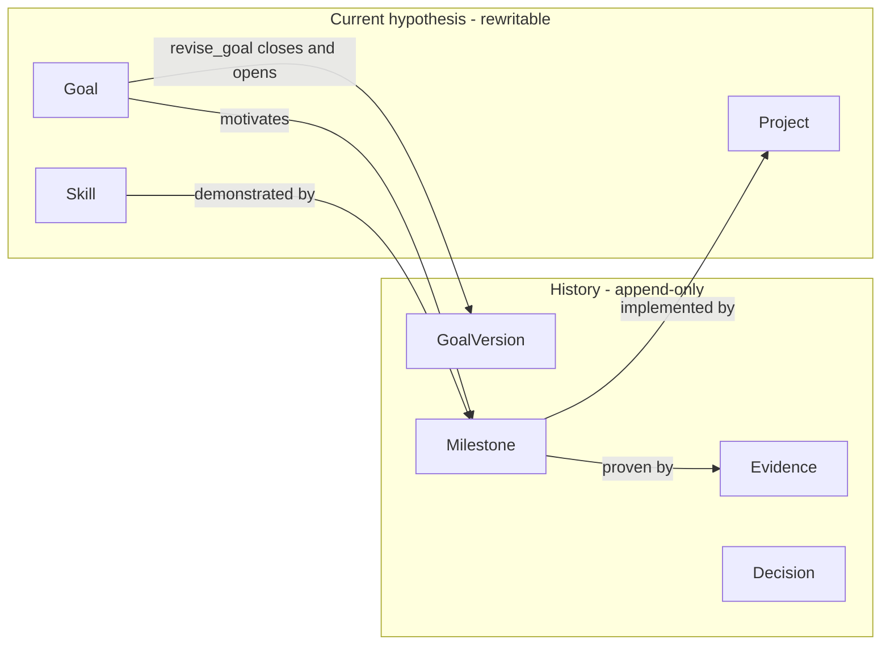
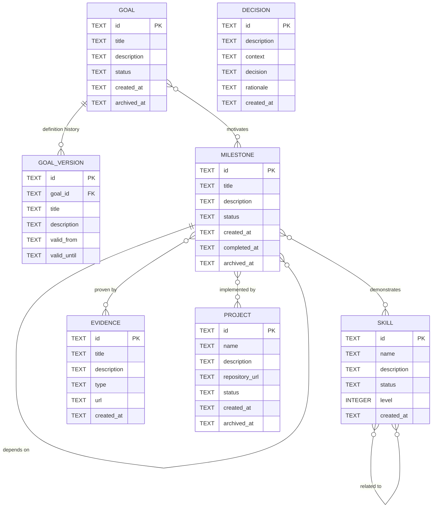

# Goal tracker — domain model

Reference map of the domain. The Mermaid diagrams render on GitHub and in editors
with a Mermaid preview (VS Code: Markdown Preview Mermaid Support). Keep this
file in sync with `core/src/model.rs` and `core/src/schema.rs`. A rendered
snapshot of the ER diagram is checked in as `domain-model.svg`.

## Two zones

The core distinction: goals, skills and projects are the current hypothesis and
may be rewritten; goal versions, milestones, evidence and decisions are history
and are never rewritten when the hypothesis changes.

## Entity relationships

## Storage mapping

Many-to-many relationships are stored in dedicated join tables. Every table has
a matching `impl_record!` in `core/src/model.rs`; the SQL lives in
`core/src/schema.rs`.

| Relationship                | Cardinality | Join table               |
| --------------------------- | ----------- | ------------------------ |
| Goal motivates Milestone    | M:N         | `milestone_goals`        |
| Milestone demonstrates Skill| M:N         | `milestone_skills`       |
| Milestone proven by Evidence| M:N         | `milestone_evidence`     |
| Milestone implemented by Project | M:N    | `milestone_projects`     |
| Milestone depends on Milestone | M:N     | `milestone_dependencies` |
| Skill related to Skill      | M:N         | `skill_relationships`    |

| Direct relationship         | Cardinality | Foreign key                     |
| --------------------------- | ----------- | ------------------------------- |
| Goal definition history     | 1:N         | `goal_versions.goal_id`         |

Deleting a skill cascades to `milestone_skills` and `skill_relationships`
(`ON DELETE CASCADE`), so no orphan links can remain. Milestone deletion still
requires its links to be removed first.

`decisions` is a standalone journal: `description`, `context`, `decision`,
`rationale` and date, with no links to other entities.

## Enumerations

| Enum              | Values                                                                                  |
| ----------------- | --------------------------------------------------------------------------------------- |
| `GoalStatus`      | `active`, `paused`, `achieved`, `abandoned`, `archived`                                 |
| `SkillStatus`     | `active`, `learning`, `paused`, `archived`                                              |
| `MilestoneStatus` | `planned`, `in_progress`, `blocked`, `completed`, `archived`                            |
| `ProjectStatus`   | `planned`, `active`, `paused`, `completed`, `archived`                                  |
| `EvidenceType`    | `repository`, `pull_request`, `blog_post`, `benchmark`, `production`, `architecture_document`, `conference_talk`, `code_review`, `certification`, `other` |

## Rules and invariants

- A seed file is validated fully (unique ids, resolvable references, parseable
  enums, skill levels 0-10) before anything is written, and is applied in one
  transaction. One seed file describes exactly one goal.
- Milestone `criteria`, `evidence` and `validation` are seed prose rendered into
  `milestones.description`.
- Skill levels are integers from 0 to 10 (`model::MAX_LEVEL`) and are validated
  wherever they are written.
- `history::revise_goal` closes the open `GoalVersion` and opens a new one when
  a goal's title or description changes; status changes do not create versions.
  Goal edits and their version record commit in the same transaction.
- The store refuses to start when a table in the model is missing columns
  (`verify_schema`); migrations are tracked with `PRAGMA user_version`.
- `list_where` and `delete_where` accept only `'static` column names, so user
  input can never reach an identifier position.
